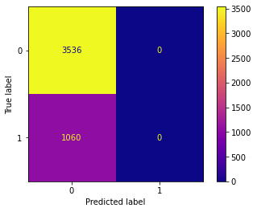
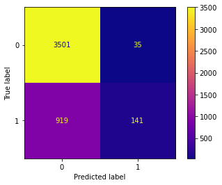

# Analyzing Seasonal and H1N1 Flu Surveys

-Student Names: Nick Kennedy, Tim Cleary, Elijah Jarocki

### **Business and Data Understanding**

In 2009, a virulent h1n1, or swine flu variant began infecting much of the population. It was a virus of concern due it's potential to make people very sick, even more so than tha seasonal flu could. When it became clear that medical efforts were needed, vaccines, both injectable as well as a nasal vaccine containing live, attenuated h1n1 virus were created to minimize risk. However, many of these, especially the more effective (but higher in side-effects) nasal/live vaccine were not widely available across the country. In this report we hope to address the issues concerning vaccination production and vaccination rates.

The Data we used was from the CDC's 2009 National H1N1 Flu Vaccine Survey of nearly 27K respondents. It is entirely comprised of basic medical, behavioral, and demographic information.


---

### **Data Preparation**

When we first looked at our data we noticed that 3 columns had more than half the total entries as null values. We decided it was safe to drop them from the set to maximize our number of observations for modeling. After pruning those 3 we split up our numerical and object columns into 2 different dataframes. Data was dummied for our objects and passed back in, then concatenated back with our numerical columns from before, creating an encoded dataframe to work with. After dropping our null values we were left with almost 23k observations, a majority of the original.

---

### **Modeling**

After a basic train test split on our newly created object, we ran a confusion matrix to see our positives and negatives. Since we decided to focus on precision this is especially relevant. 



Our precision is 0 because our model predicts no positives, but our accuracy for the baseline is 77%. Not bad, but we need to tune it.

For our next step we used Grid Search with parameters set to a random forest classifier. This process will take in a list of parameters and run several models to determine the optimal params to further tune our model. Plugging those in to our random forest model led to a precision score of 80%, an improvement!

An updated confusion matrix confirms our model has a very low amount of false-positives.



In addition to our inferential RFC model, we also decided to run Logistic Regression and compare outcomes. We first created a list of the top 30 features from our original encoded dataframe and ran that through to see. We ended up with a precision score of only 70 for our logistic regression which isn't bad at all, but the random forest is clearly the superior model for the problem at hand.

---

### **Conclusion**

Through our findings we've discovered that a relationship with/ reccomendation from one's MD is critical for vaccine-willingness in patients. We also learned that these Dr. Reccomendations are given at a much higher rate to older generations. In the world-changing global pandemic of SARS COVID-19, the world saw that younger people are much more amenable to receiving vaccines. Thus we propose measures to increase Dr. reccomendations to younger demographics. 

---

### **Going Forward**

For further research we intend to look at the impacts of whether or not the survey takers have health insurance, or if they have contracted the flu in the past.

---

### **Repository Structure**
```
.
├── /img
├── .gitignore
├── FINAL.ipynb
├── README.md
├── data1.csv
└── project3.pdf
```
